# 🚀 Copilot CLI Quick Start

> **Your friendly terminal tutor** — learn GitHub Copilot CLI by doing, not reading! 🐙✨

[](https://github.com/features/copilot)
[](LICENSE)
[](SECURITY.md)

---

## 🤔 What Is This?

**Copilot CLI Quick Start** is a [Copilot CLI skill](https://docs.github.com/copilot/concepts/agents/about-copilot-cli) that teaches you how to use GitHub Copilot CLI — interactively, right inside your terminal. No docs to read. No videos to watch. Just you and a friendly AI tutor that walks you through everything step by step. 🎓

It features **two learning tracks** so everyone can learn at their own pace:
- 🧑‍💻 **Developer Track** — terminal shortcuts, file mentions, custom instructions, MCP, and more
- 🎨 **Non-Developer Track** — writing, task planning, understanding code, and getting summaries

Designed for **absolute beginners**. Even if you've never touched a terminal, we've got you! 🫶

---

## 📦 Installation

### Prerequisites

- [GitHub Copilot CLI](https://github.com/github/copilot-cli) installed (`brew install copilot-cli` or `npm install -g @github/copilot`)
- An active [Copilot subscription](https://github.com/features/copilot/plans)

### Add the Skill

Inside a Copilot CLI session, run:

```
/skills add DUBSOpenHub/copilot-cli-quickstart
```

That's it! One command. You're ready. 🎉

---

## 🎮 Usage

### 🎓 Tutorial Mode — Learn Step by Step

```
> start tutorial
```

The tutor asks if you're a **Developer** or **Non-Developer**, then walks you through the right lessons:

#### 📚 Shared Lessons (Both Tracks)

| # | Lesson | What You'll Learn |
|---|--------|-------------------|
| 🏠 S1 | **Welcome & Verify** | Orientation, confirm CLI is working |
| 💬 S2 | **Your First Prompt** | Talk to Copilot in plain English |
| 🎮 S3 | **The Permission Model** | YOU are always in control |

#### 🧑‍💻 Developer Track

| # | Lesson | What You'll Learn |
|---|--------|-------------------|
| 🎛️ D1 | **Slash Commands & Modes** | `/` powers, `Shift+Tab`, `!` shortcut |
| 📎 D2 | **File Mentions with @** | Point Copilot at specific files |
| 📋 D3 | **Planning with /plan** | Break tasks into steps before coding |
| ⚙️ D4 | **Custom Instructions** | Make Copilot work YOUR way |
| 🚀 D5 | **Advanced** | MCP servers, skills, models |

#### 🎨 Non-Developer Track

| # | Lesson | What You'll Learn |
|---|--------|-------------------|
| 📝 N1 | **Writing & Editing** | Use Copilot as your writing assistant |
| 📋 N2 | **Task Planning** | Break down projects with /plan |
| 🔍 N3 | **Understanding Code** | Read code without writing it |
| 📊 N4 | **Summaries & Extraction** | Get key info from any document |

### ❓ Q&A Mode — Just Ask!

```
> what does /compact do?
```

```
> how do I switch models?
```

```
> what's the difference between plan mode and interactive mode?
```

Ask anything about Copilot CLI and get a clear, beginner-friendly answer with examples! 💡

---

## 🌟 Why This Skill?

| Without this skill | With this skill |
|-------------------|-----------------|
| 📖 Read long docs | 🎮 Learn by doing |
| 😰 Intimidating terminal | 🎉 Fun and friendly |
| 🤷 "Where do I start?" | 📍 Guided step by step |
| 👤 One-size-fits-all | 🛤️ Dev & Non-Dev tracks |
| 📝 Take notes | 🧠 Progress tracked for you |
| 😐 Solo learning | 🤝 Interactive exercises |

---

## 🏗️ Architecture

```mermaid
flowchart TD
    USER["👤 User"] --> SKILL["🧠 SKILL.md<br/>Lesson content & rules"]
    SKILL --> AGENT["🤖 agent.md<br/>Persona & tool config"]
    AGENT --> SQL["🗄️ SQL<br/>Progress tracking"]
    AGENT --> DOCS["📚 fetch_docs<br/>Live documentation"]
    AGENT --> ASK["🙋 ask_user<br/>Interactive exercises"]
    PRD["📋 PRD<br/>Design & diagrams"] -.-> SKILL
    CAT["📦 catalog.yml<br/>Metadata"] -.-> SKILL
```



---

## 🏗️ Project Structure

```
copilot-cli-quickstart/
├── .github/
│   ├── ISSUE_TEMPLATE/               ← 🐛 Bug, feature, & lesson templates
│   ├── PULL_REQUEST_TEMPLATE.md      ← 📝 PR checklist
│   └── copilot/skills/
│       └── copilot-cli-quickstart/
│           └── SKILL.md → (symlink)  ← 🔗 Points to canonical source
├── agents/
│   ├── copilot-cli-quickstart.agent.md  ← 🤖 Agent config
│   └── copilot-cli-quickstart.md        ← 📋 PRD (Product Requirements Doc)
├── skills/
│   └── copilot-cli-quickstart/
│       ├── SKILL.md              ← 🧠 The brain — canonical skill source
│       └── catalog.yml           ← 📋 Camp Air catalog metadata
├── .gitignore
├── CHANGELOG.md                  ← 📋 Version history
├── CODE_OF_CONDUCT.md            ← 🤝 Contributor Covenant
├── CONTRIBUTING.md               ← 🛠️ How to contribute
├── LICENSE                       ← 📄 MIT
├── SECURITY.md                   ← 🔒 Security policy
├── TESTING.md                    ← 🧪 Conversation playbooks & QA
└── README.md                     ← 👋 You are here!
```

---

## 🔒 Security

See [SECURITY.md](SECURITY.md) for our security policy and how to report vulnerabilities.

This repo has **Dependabot alerts** and **automated security updates** enabled. 🛡️

---

## 🤝 Contributing

Got ideas to make this tutor even better? 🎨 See [CONTRIBUTING.md](CONTRIBUTING.md) for the full guide!

**Quick ways to help:**
- 🐛 [Report a bug](https://github.com/DUBSOpenHub/copilot-cli-quickstart/issues/new?template=bug_report.md)
- 💡 [Suggest a feature](https://github.com/DUBSOpenHub/copilot-cli-quickstart/issues/new?template=feature_request.md)
- 📚 [Propose a lesson](https://github.com/DUBSOpenHub/copilot-cli-quickstart/issues/new?template=lesson_idea.md)
- ✏️ Fix a typo — just open a PR!

See [TESTING.md](TESTING.md) for conversation playbooks and QA checklists.

---

## 📄 License

[MIT](LICENSE) — use it, share it, remix it! 🎶

---

## 🐙 Built with Love

Made with 💜 by [DUBSOpenHub](https://github.com/DUBSOpenHub) to help more people discover the joy of GitHub Copilot CLI.

**Happy learning!** 🚀✨
