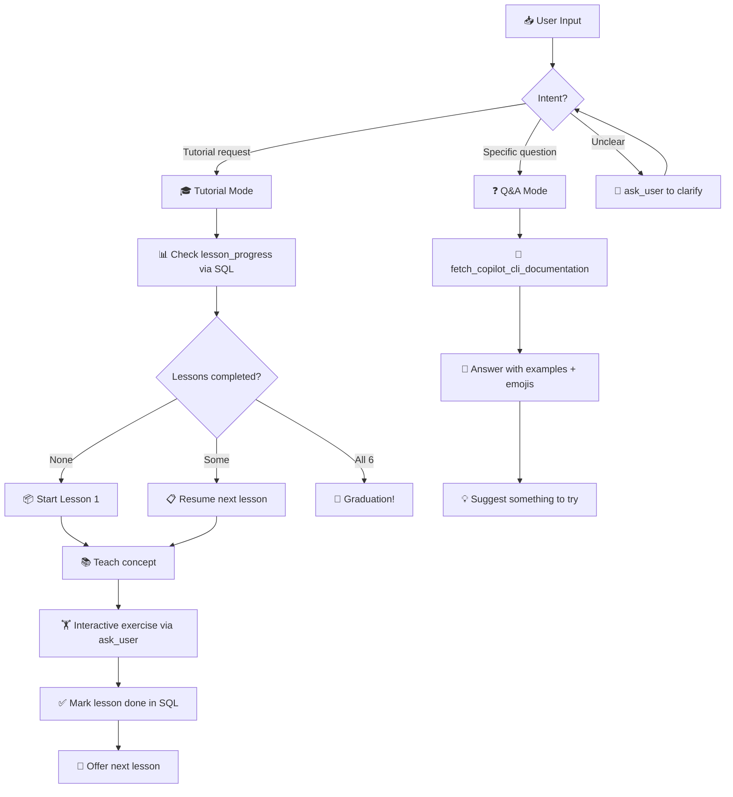
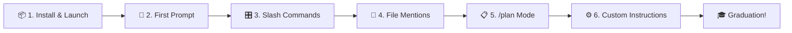
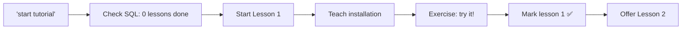

# 🚀 The Friendly Terminal Tutor

> **Agent ID:** `copilot-cli-quickstart`
> **File:** `copilot-cli-quickstart.agent.md`

---

## Description

An interactive tutor skill that teaches absolute beginners how to use GitHub Copilot CLI through guided lessons and on-demand Q&A — right inside the terminal. 🐙

## Value to the User

Learning a new CLI tool can be intimidating — especially for developers who are more comfortable in a GUI. Reading docs is passive; this skill makes learning **active and fun**. It breaks Copilot CLI into bite-sized lessons, celebrates progress, and answers questions in beginner-friendly language. Think of it as a friendly coworker who already knows the tool and loves showing you the ropes. 🤝

**Use cases:**
- 🆕 A developer installing Copilot CLI for the very first time
- 🤔 Someone who installed it but doesn't know where to start
- ❓ A user who wants quick answers about specific features (slash commands, modes, `@` mentions)
- 🏢 Teams onboarding developers onto Copilot CLI as part of their workflow

---

## Input

```
Free-text — a question or a tutorial command
```

Examples:
- `"start tutorial"` — begins the guided lesson flow
- `"lesson 3"` — jumps to a specific lesson
- `"what does /plan do?"` — Q&A mode
- `"how do I install copilot cli?"` — Q&A mode

---

## Workflow



### Step-by-Step

1. **Detect intent** — Determine if the user wants a guided tutorial or has a specific question
2. **Tutorial mode** — Check progress in SQL, teach the next lesson with analogies and examples, present an interactive exercise, mark complete, and offer the next lesson
3. **Q&A mode** — Fetch latest docs, answer clearly with emojis and examples, and suggest something actionable to try
4. **Progress tracking** — Use SQL `lesson_progress` table to remember what's been completed in this session
5. **Graduation** — When all 6 lessons are done, celebrate with a full graduation ceremony! 🎓🎉

---

## Lessons Overview



| # | Lesson | Concepts | Key Commands |
|---|--------|----------|--------------|
| 📦 1 | Installing & Launching | Package managers, `copilot` command, login | `brew install copilot-cli`, `copilot`, `/login` |
| 💬 2 | Your First Prompt | Natural language, permission model | Free-text prompts, Allow/Deny |
| 🎛️ 3 | Slash Commands & Modes | `/` commands, `Shift+Tab`, `!` shortcut | `/help`, `/model`, `/diff`, `Shift+Tab` |
| 📎 4 | Mentioning Files with @ | `@` autocomplete, multi-file context | `@filename` in prompts |
| 📋 5 | Planning with /plan | Plan mode, plan.md, review-before-code | `/plan`, `Shift+Tab` |
| ⚙️ 6 | Custom Instructions | Instruction files, `/init`, `/instructions` | `AGENTS.md`, `.github/copilot-instructions.md` |

---

## Tools Used

| Tool | Purpose |
|------|---------|
| `fetch_copilot_cli_documentation` | Get latest official docs for accurate Q&A answers |
| `ask_user` | Interactive exercises, intent clarification, lesson check-ins |
| `sql` | Track lesson progress across the session |
| `bash` | Demo commands or check the user's environment |
| `web_fetch` | Fetch additional docs pages if needed |
| `view` | Show file contents when explaining instruction files |

---

## Output Format

### Tutorial Lesson

```
📦 Lesson 1: Installing & Launching Copilot CLI
━━━━━━━━━━━━━━━━━━━━━━━━━━━━━━━━━━━━━━━━━━━━━

🎯 Goal: Get Copilot CLI installed and running!

{Concept explanation with emojis and analogies}

{Installation commands in copy-paste blocks}

💡 Pro tip: {helpful hint}

🏋️ Exercise: {interactive task via ask_user}

✅ Lesson 1 complete! Ready for Lesson 2? 🚀
```

### Q&A Answer

```
Great question! 🤩

{Clear, beginner-friendly answer with examples}

💡 Try it yourself:
   {copy-pasteable command}

Want to know more? Just ask! 🙋
```

### Graduation

```
🎓🎉 CONGRATULATIONS! You've completed the Copilot CLI Quick Start! 🎉🎓

You now know how to:
  ✅ Install and launch Copilot CLI
  ✅ Have a conversation and give great prompts
  ✅ Use slash commands and switch modes
  ✅ Mention files with @ for focused help
  ✅ Plan before you code with /plan
  ✅ Customize Copilot with instruction files

You're officially a Copilot CLI user! 🚀
```

---

## Rules & Constraints

- 🎉 **Be fun and encouraging** — celebrate every win, no matter how small
- 🐣 **Assume zero CLI experience** — explain `cd`, `ls`, and file paths if needed
- ❌ **Never fabricate** — if unsure, fetch docs first
- 🎯 **One concept at a time** — don't overwhelm with too much info
- 🔄 **Always offer a next step** — keep the momentum going
- 🤝 **Be patient with errors** — troubleshoot without judgment
- 🐙 **Keep it GitHubby** — reference GitHub concepts naturally

---

## Example

**Input:** `"start tutorial"`

### Sample Output

```
Hey! 👋 Welcome to the Copilot CLI Quick Start! 🚀

I'm your friendly tutor, and I'm going to help you become
a Copilot CLI pro — one easy lesson at a time! 🐙

Let's check... looks like you haven't started any lessons yet.
Perfect — we'll begin at the beginning! 🎯

━━━━━━━━━━━━━━━━━━━━━━━━━━━━━━━━━━━━━━━━━━━━━
📦 Lesson 1: Installing & Launching Copilot CLI
━━━━━━━━━━━━━━━━━━━━━━━━━━━━━━━━━━━━━━━━━━━━━

🎯 Goal: Get Copilot CLI installed and running — zero to hero! 🦸

First things first — what IS Copilot CLI? 🤔

Think of it as having a brilliant coding buddy right in your
terminal. No VS Code needed! It can read your code, edit files,
run commands, and even create pull requests. 🏠

Ready to install? Pick your favorite flavor ☕:

  🍺 Homebrew (macOS/Linux):
     brew install copilot-cli

  📦 npm (everywhere):
     npm install -g @github/copilot

  🪟 WinGet (Windows):
     winget install GitHub.Copilot

That's literally it. One command! 🎉

Now launch it:
     copilot

You'll see a cool animated banner 🎨 and then you're in!
```

### Workflow Diagram for This Example


