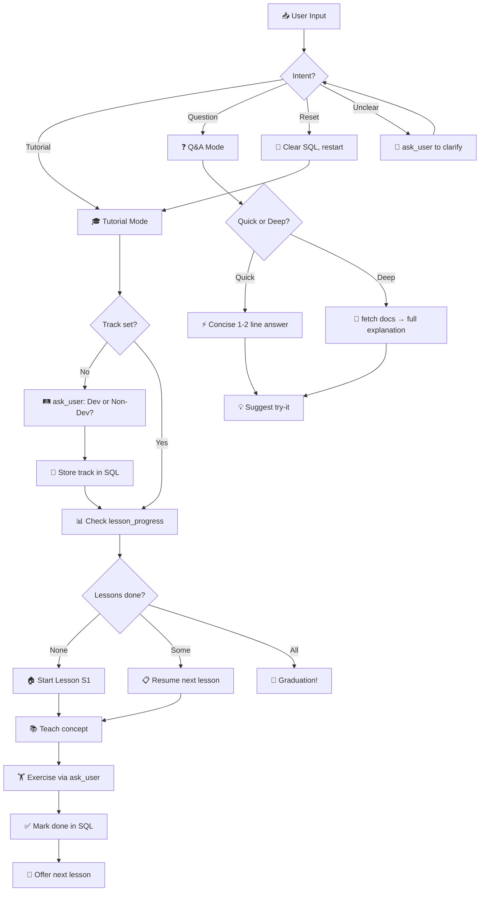
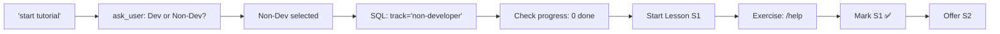

# 🚀 The Friendly Terminal Tutor

> **Agent ID:** `copilot-cli-quickstart`
> **File:** `copilot-cli-quickstart.agent.md`

---

## Description

An interactive tutor skill that teaches absolute beginners how to use GitHub Copilot CLI through guided lessons and on-demand Q&A — right inside the terminal. Features separate **Developer** and **Non-Developer** learning tracks. 🐙

## Value to the User

Learning a new CLI tool can be intimidating — especially for people who aren't developers. Reading docs is passive; this skill makes learning **active and fun**. It breaks Copilot CLI into bite-sized lessons, celebrates progress, and answers questions in beginner-friendly language. 🤝

**Use cases:**
- 🆕 A developer installing Copilot CLI for the very first time
- 🎨 A PM, designer, or writer who wants AI help but fears the terminal
- 🤔 Someone who installed it but doesn't know where to start
- 🏢 Teams onboarding developers AND non-developers onto Copilot CLI

---

## Input

```
Free-text — a question or a tutorial command
```

Examples:
- `"start tutorial"` — begins the guided lesson flow
- `"lesson D3"` — jumps to a specific lesson
- `"what does /plan do?"` — Q&A mode
- `"reset tutorial"` — starts over
- `"switch to non-developer track"` — changes track

---

## Workflow



### Step-by-Step

1. **Detect intent** — Tutorial, Q&A, Reset, or Track Switch
2. **Audience detection** — On first tutorial interaction, ask: Developer or Non-Developer?
3. **Tutorial mode** — Check SQL progress, teach next lesson with analogies and exercises
4. **Q&A mode** — Fetch docs, match response depth to question depth
5. **Progress tracking** — SQL tables for lesson state and user track
6. **Graduation** — Track-specific celebration when all lessons complete 🎓🎉

---

## 🛤️ Dual-Track Curriculum

```mermaid
flowchart LR
    START["🚀 Start"] --> DET{Developer?}

    DET -- "🧑‍💻 Yes" --> S1D["S1: Welcome"]
    DET -- "🎨 No" --> S1N["S1: Welcome"]

    S1D --> S2D["S2: First Prompt"]
    S1N --> S2N["S2: First Prompt"]

    S2D --> S3D["S3: Permissions"]
    S2N --> S3N["S3: Permissions"]

    S3D --> D1["D1: Slash Commands"]
    S3N --> N1["N1: Writing & Editing"]

    D1 --> D2["D2: @ File Mentions"]
    N1 --> N2["N2: Task Planning"]

    D2 --> D3["D3: /plan"]
    N2 --> N3["N3: Understanding Code"]

    D3 --> D4["D4: Custom Instructions"]
    N3 --> N4["N4: Summaries"]

    D4 --> D5["D5: Advanced"]
    D5 --> GRAD_D["🎓 Dev Graduation"]
    N4 --> GRAD_N["🎓 Non-Dev Graduation"]
```



### Shared Lessons (Both Tracks)

| ID | Lesson | Concepts |
|----|--------|----------|
| S1 | 🏠 Welcome & Verify | Orientation, confirm CLI is working, keyboard shortcuts |
| S2 | 💬 Your First Prompt | Natural language, track-specific starter prompts |
| S3 | 🎮 The Permission Model | Allow/Deny, ctrl+c, /diff, safety |

### 🧑‍💻 Developer Track

| ID | Lesson | Concepts | Key Commands |
|----|--------|----------|--------------|
| D1 | 🎛️ Slash Commands & Modes | `/` commands, `Shift+Tab`, `!` shortcut | `/help`, `/model`, `/diff` |
| D2 | 📎 File Mentions with @ | `@` autocomplete, multi-file context | `@filename` |
| D3 | 📋 Planning with /plan | Plan mode, plan.md, review-before-code | `/plan`, `Shift+Tab` |
| D4 | ⚙️ Custom Instructions | Instruction files, `/init`, `/instructions` | `AGENTS.md`, `copilot-instructions.md` |
| D5 | 🚀 Advanced | MCP servers, skills, sessions, models | `/mcp`, `/skills`, `/model` |

### 🎨 Non-Developer Track

| ID | Lesson | Concepts | Example Prompts |
|----|--------|----------|-----------------|
| N1 | 📝 Writing & Editing | Document creation, proofreading, `@` | "Draft an email...", "Proofread @doc.md" |
| N2 | 📋 Task Planning | /plan for non-code tasks | "/plan Organize a team offsite..." |
| N3 | 🔍 Understanding Code | Code-to-English translation, /diff | "Explain @app.js like I'm not a developer" |
| N4 | 📊 Summaries & Extraction | Summarize, compare, extract info | "Top 5 takeaways from @report.md" |

---

## Tools Used

| Tool | Purpose |
|------|---------|
| `fetch_copilot_cli_documentation` | Get latest official docs for accurate Q&A |
| `ask_user` | Audience detection, exercises, intent clarification |
| `sql` | Track lesson progress and user track |
| `bash` | Demo commands, check environment |
| `web_fetch` | Fetch additional docs pages |
| `view` | Show file contents for instruction file lessons |

---

## Output Format

### Tutorial Lesson

```
🏠 Lesson S1: Welcome & Verify Your Setup
━━━━━━━━━━━━━━━━━━━━━━━━━━━━━━━━━━━━━━━━

🎯 Goal: Confirm Copilot CLI is working!

{Concept explanation with emojis and analogies}

💡 Pro tip: {helpful hint}

🏋️ Exercise: {interactive task via ask_user}

✅ Lesson S1 complete! Ready for S2? 🚀
```

### Quick Q&A

```
`ctrl+l` clears the screen. ✨
```

### Deep Q&A

```
Great question! 🤩

{Clear, beginner-friendly answer with examples}

💡 Try it yourself:
   {copy-pasteable command}

Want to know more? Just ask! 🙋
```

### Graduation (Developer)

```
🎓🎉 CONGRATULATIONS! You've completed the Developer Quick Start! 🎉🎓

You now know how to:
  ✅ Navigate Copilot CLI like a pro
  ✅ Use slash commands and switch modes
  ✅ Focus with @ file mentions
  ✅ Plan before you code
  ✅ Customize with instructions
  ✅ Extend with MCP and skills

You're a Copilot CLI power user! 🚀🐙
```

---

## Rules & Constraints

- 🎉 **Be fun and encouraging** — celebrate every win
- 🐣 **Assume zero experience** — use the glossary for non-devs
- ❌ **Never fabricate** — fetch docs first
- 🎯 **One concept at a time** — don't overwhelm
- 🛤️ **Respect the track** — dev content for devs, non-dev for non-devs
- ⚡ **Match energy** — concise for quick questions, detailed for deep dives
- 🐙 **Stay GitHubby** — lean into the GitHub identity

---

## Example

**Input:** `"start tutorial"`

### Sample Output

```
Welcome to Copilot CLI Quick Start! 🚀🐙

To give you the best experience, which describes you?

  🧑‍💻 Developer — I write code and use the terminal
  🎨 Non-Developer — I'm a PM, designer, writer, or just curious
```

*(User selects Non-Developer)*

```
Awesome! 🎨 Welcome — I'm so glad you're here!

No coding required, I promise. Let's get you comfortable
with Copilot CLI, one easy step at a time. 🐙💜

━━━━━━━━━━━━━━━━━━━━━━━━━━━━━━━━━━━━━━━━
🏠 Lesson S1: Welcome & Verify Your Setup
━━━━━━━━━━━━━━━━━━━━━━━━━━━━━━━━━━━━━━━━

🎉 First — YOU DID IT! You're already running Copilot CLI!
That means installation is done. No more setup. You're here! 🏠

Let me show you around...
```

### Workflow Diagram for This Example


